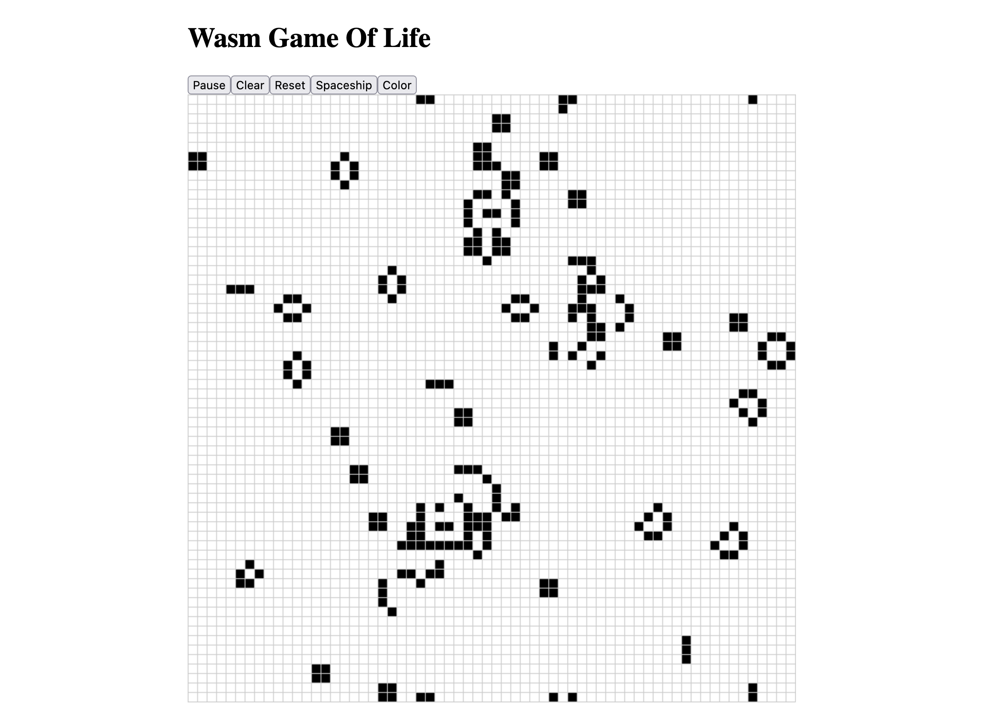

# wasm-game-rs

Example of a Rust/WASM game using trunk and leptos.


Implements a simple Conway's Game of Life simulation.

Feel free to use as a template for interactive Rust/WASM projects.



## Requirements
* yarn 

## Usage

```bash
# Install trunk
yarn prepare
# Dev server
yarn dev
# Build
yarn build
```
